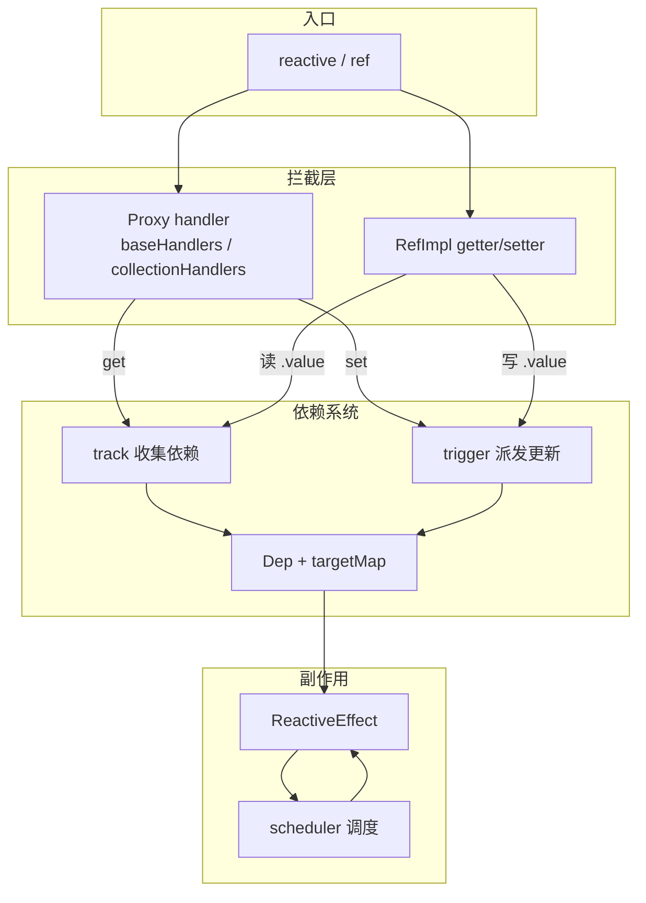
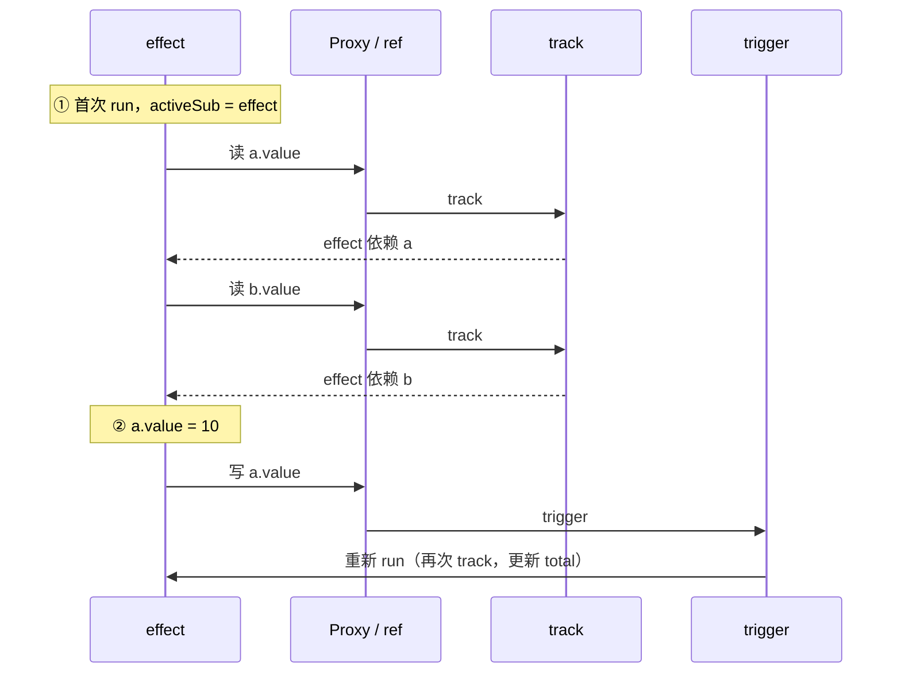

# Vue3 Proxy 响应式核心机制

> 对照 [Vue 官方 · 深入响应式系统](https://cn.vuejs.org/guide/extras/reactivity-in-depth) 与 `@vue/reactivity` 源码整理，便于按文件查阅代码。

---

## 一句话

```
读数据  →  Proxy get  →  track()   →  把当前 effect 记到属性的 Dep 里
写数据  →  Proxy set  →  trigger() →  通知 Dep 里的 effect 重新执行
```

组件渲染、`watchEffect`、`computed` 底层都是 **effect**；数据变了 → effect 重跑 → 视图更新。

---

## 源码地图（查阅顺序）

> 响应式全部在 **`packages/reactivity/`**，不在 `runtime-core`。  
> `component.ts` 里的 Proxy 是组件实例代理（`instance.proxy`），与 `reactive()` 无关。

| 顺序 | 文件 | 查什么 |
|:--:|------|--------|
| 1 | `reactive.ts` | `reactive()` 入口 → `createReactiveObject()` → `new Proxy(target, handlers)` |
| 2 | `baseHandlers.ts` | 普通对象/数组：**get → track**，**set → trigger** |
| 3 | `collectionHandlers.ts` | Map / Set / WeakMap / WeakSet 的 get/set 版 track/trigger |
| 4 | `dep.ts` | `track()` / `trigger()` 实现；`Dep` 类；`targetMap` 数据结构 |
| 5 | `effect.ts` | `ReactiveEffect`；`activeSub`；effect 的 run / notify / 调度 |
| 6 | `ref.ts` | 基本类型：`RefImpl` 的 getter/setter 版 track/trigger（不走 Proxy） |
| 7 | `computed.ts` | computed 作为带缓存的特殊 effect |
| 8 | `watch.ts` | watch / watchEffect 对 effect 的封装 |

**建议阅读路径：** `reactive.ts` → `baseHandlers.ts` → `dep.ts` → `effect.ts` → `ref.ts`

---

## 整体架构



**数据结构（`dep.ts`）：**

```
targetMap: WeakMap<原始对象, Map<属性key, Dep>>
                              ↓
                         Dep.subs → 订阅了该属性的 effect 链表
effect.deps  → 该 effect 依赖了哪些 Dep（双向链表 Link 连接）
```

---

## 第一步：创建 Proxy（`reactive.ts`）

```89:105:packages/reactivity/src/reactive.ts
export function reactive(target: object) {
  if (isReadonly(target)) {
    return target
  }
  return createReactiveObject(
    target,
    false,
    mutableHandlers,
    mutableCollectionHandlers,
    reactiveMap,
  )
}
```

`createReactiveObject` 核心逻辑：

1. 非对象 / 不可扩展 / 已代理 → 直接返回
2. `proxyMap.get(target)` 命中 → 返回已有 Proxy（同一原始对象只代理一次）
3. 按类型选 handler：Object/Array 用 `baseHandlers`，Map/Set 用 `collectionHandlers`
4. `new Proxy(target, handler)` 并缓存到 `proxyMap`

```315:320:packages/reactivity/src/reactive.ts
  const proxy = new Proxy(
    target,
    targetType === TargetType.COLLECTION ? collectionHandlers : baseHandlers,
  )
  proxyMap.set(target, proxy)
  return proxy
```

官方伪代码与源码的对应关系：

```js
// 伪代码（官方文档）
function reactive(obj) {
  return new Proxy(obj, {
    get(target, key) {
      track(target, key)   // 读 → 收集依赖
      return target[key]
    },
    set(target, key, value) {
      target[key] = value
      trigger(target, key) // 写 → 触发更新
    }
  })
}
// 真实实现比伪代码复杂：只读跳过 track、嵌套对象递归 reactive、数组/ref 特殊处理等
```

---

## 第二步：拦截读写（`baseHandlers.ts`）

### get → track（读 → 收集依赖）

```112:114:packages/reactivity/src/baseHandlers.ts
    if (!isReadonly) {
      track(target, TrackOpTypes.GET, key) // 读 → 收集依赖
    }
```

get 里在 `Reflect.get` 之后、返回值之前调用 `track`。只读对象不收集依赖。

get 还负责：嵌套对象转 `reactive()`、ref 自动解包、数组方法拦截（`arrayInstrumentations`）等。

### set → trigger（写 → 触发更新）

```184:190:packages/reactivity/src/baseHandlers.ts
    if (target === toRaw(receiver)) {
      if (!hadKey) {
        trigger(target, TriggerOpTypes.ADD, key, value) // 写 → 触发更新
      } else if (hasChanged(value, oldValue)) {
        trigger(target, TriggerOpTypes.SET, key, value, oldValue) // 写 → 触发更新
      }
    }
```

- 新增属性 → `TriggerOpTypes.ADD`
- 修改已有属性且值变了 → `TriggerOpTypes.SET`
- 值未变 → 不 trigger（性能优化）

`deleteProperty` / `has` / `ownKeys` 等同理，各自在对应 trap 里 track 或 trigger。

### handler 导出

```251:258:packages/reactivity/src/baseHandlers.ts
export const mutableHandlers: ProxyHandler<object> =
  /*@__PURE__*/ new MutableReactiveHandler()

export const shallowReactiveHandlers: MutableReactiveHandler =
  /*@__PURE__*/ new MutableReactiveHandler(true)
```

| handler | 行为 |
|---------|------|
| `mutableHandlers` | 深度响应式（默认 `reactive()`） |
| `shallowReactiveHandlers` | 仅根层响应式 |
| `readonlyHandlers` | 只读，get 不 track，set 拦截 |

---

## 第三步：track / trigger（`dep.ts`）

### track — 依赖收集

```262:283:packages/reactivity/src/dep.ts
export function track(target: object, type: TrackOpTypes, key: unknown): void {
  if (shouldTrack && activeSub) {
    let depsMap = targetMap.get(target)
    if (!depsMap) {
      targetMap.set(target, (depsMap = new Map()))
    }
    let dep = depsMap.get(key)
    if (!dep) {
      depsMap.set(key, (dep = new Dep()))
      dep.map = depsMap
      dep.key = key
    }
    dep.track()
  }
}
```

三个前提：

1. `shouldTrack === true`（effect 运行期间才收集）
2. `activeSub` 存在（有正在运行的 effect）
3. 按 `原始对象 → key → Dep` 找到订阅桶，把当前 effect 挂上去

**通俗理解：** effect 读 `state.count` 时，track 记下「这个 effect 用了 count」。

### trigger — 派发更新

```294:324:packages/reactivity/src/dep.ts
export function trigger(
  target: object,
  type: TriggerOpTypes,
  key?: unknown,
  // ...
): void {
  const depsMap = targetMap.get(target)
  if (!depsMap) {
    return
  }

  const run = (dep: Dep | undefined) => {
    if (dep) {
      dep.trigger()
    }
  }
  // 根据 SET / ADD / DELETE / CLEAR 等类型，找到对应 Dep 逐个 trigger
}
```

`dep.trigger()` → effect.notify() → 进入调度队列 → effect 重新 run。

**通俗理解：** `state.count = 2` 时，trigger 通知所有订阅了 count 的 effect 重新执行。

---

## 第四步：effect 如何串联（`effect.ts`）

effect 运行时会把自身设为 `activeSub`，这样 get 里的 track 才知道「当前是谁在读」：

```173:179:packages/reactivity/src/effect.ts
    const prevEffect = activeSub
    activeSub = this
    shouldTrack = true

    try {
      return this.fn()
```

| 概念 | 说明 |
|------|------|
| `activeSub` | 当前正在运行的 effect（类似 Vue2 的 `Dep.target`） |
| `effect.run()` | 执行 fn，期间所有 get 触发 track |
| `effect.notify()` | 被 trigger 调用，标记 dirty 并入队调度 |
| `scheduler` | 可选自定义调度（组件 render effect 用它做异步批量更新） |

---

## 例外：ref 不走 Proxy（`ref.ts`）

基本类型无法被 Proxy 代理，ref 用 **getter/setter** 实现同样机制：

```137:159:packages/reactivity/src/ref.ts
  get value() {
    this.dep.track()
    return this._value
  }

  set value(newValue) {
    // ...
    if (hasChanged(newValue, oldValue)) {
      this._value = useDirectValue ? newValue : toReactive(newValue)
      this.dep.trigger()
    }
  }
```

| API | 拦截方式 | track/trigger 位置 |
|-----|----------|-------------------|
| `reactive(obj)` | Proxy get/set | `baseHandlers.ts` |
| `ref(x)` | RefImpl getter/setter | `ref.ts` |
| `reactive(Map)` | Proxy + collectionHandlers | `collectionHandlers.ts` |

---

## 完整一次更新流程

以 `watchEffect(() => { total.value = a.value + b.value })` 为例：



---

## 与 runtime-core 的边界

| 包 | 职责 | 常见 Proxy 用途 |
|----|------|----------------|
| `@vue/reactivity` | 数据响应式 | `reactive()` / `ref()` 的 track/trigger |
| `@vue/runtime-core` | 组件 setup / render | `instance.proxy`（组件 public 实例）、`setupContext.attrs` |

组件 render 时会创建一个 **render effect**，effect 内部读取响应式数据 → 走上述 Proxy track 链路 → 数据变化 → trigger → render effect 重跑 → patch DOM。

---

## Vue2 对照（简表）

| Vue2 | Vue3 | 职责 |
|------|------|------|
| `Object.defineProperty` | `Proxy`（ref 用 getter/setter） | 拦截读写 |
| Dep | Dep + `WeakMap → Map → Dep` | 存订阅关系 |
| Watcher | effect（ReactiveEffect） | 依赖变化后重新执行 |
| getter → dep.depend() | get → track() | 依赖收集 |
| setter → dep.notify() | set → trigger() | 派发更新 |

Vue3 优势：Proxy 可监听增删属性、数组索引、Map/Set；effect 统一驱动 render / computed / watch。

---

## 官方参考

- [深入响应式系统](https://cn.vuejs.org/guide/extras/reactivity-in-depth) — track / trigger / effect 权威说明
- [响应式基础](https://cn.vuejs.org/guide/essentials/reactivity-fundamentals) — API 使用层面
